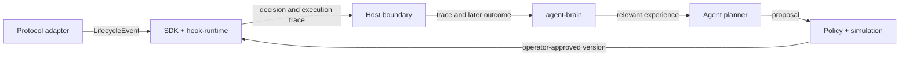

# Agent Hooks

Agent Hooks is an open source, continuous execution and experience framework for autonomous agents in Solana, crypto, and other digital worlds. A hook is a small policy that runs at a defined action boundary: it can accept an event, reject it with a reason, or return a bounded side effect. Brains retain the event and its later outcome so agents can use prior experience when planning future launches and actions.

The framework keeps execution, memory, and planning as separate interfaces. Protocol adapters normalize events; the SDK and Rust runtime compose, simulate, and evaluate hooks; the Anchor program provides an on-chain composition registry and an early eligibility executor; `agent-brain` stores event and outcome experience; and agent integrations create proposals through policy checks before an operator approves changes.

The feedback loop is:



`agent-brain` supplies a storage boundary and experience retrieval API. It does not train a model by itself: deployments choose their event store, retrieval strategy, reward definition, and model provider. This lets the open source community connect different agent stacks and share reusable hook programs and learning systems. Keep model inference and memory retrieval off the transaction-critical path; hooks that directly gate an action should be deterministic, bounded, and testable.

## How hooks work

1. An adapter observes an action such as a deposit, borrow, repay, or liquidation and creates a normalized `LifecycleEvent` with protocol, position, market/oracle snapshot, and action payload.
2. Each hook declares the lifecycle flags it supports. The runtime sorts hooks by priority and skips hooks that did not declare the event.
3. Eligible hooks inspect the event and return `Accept`, `AcceptWith(side effect)`, or `Reject(reason)`. Rejection stops the composition; accepted side effects are collected for the host to apply.
4. The host records the decision trace and later joins it with the real outcome, such as whether a position stayed healthy or a liquidation completed.
5. `agent-brain` stores the event, composition and hook identities, feedback, and tags. An agent can retrieve similar outcomes before proposing a revised composition.

This is crucial for agents because it separates *what the agent proposes* from *what the runtime permits*. Agents can adapt their plans from prior outcomes, while a narrow deterministic hook checks the next action. A model response is not itself an execution guardrail. Keep model inference and memory retrieval outside the transaction-critical path.

### What is implemented today

The local Rust runtime and TypeScript simulator evaluate hook implementations. The current Anchor program is an early on-chain registry and eligibility prototype: `run_composition` checks the event and adapter, counts matching flags, and emits receipts. It does not yet CPI into deployed hook programs or apply their side effects; its per-hook receipt decision is a placeholder. The on-chain path needs CPI execution and end-to-end integration tests before it can be treated as a production hook executor.

## Workspace packages

| Package | Responsibility | Interfaces with |
| --- | --- | --- |
| `@agent-hooks/sdk` (`packages/sdk-ts`) | TypeScript composition builder, simulator, executor client, and hook helpers | Adapters, Anchor IDL, CLI, agent-brain |
| `hook-runtime` (`packages/hook-runtime`) | Rust lifecycle types, deterministic hook composition, execution traces, and backtesting | Hook library and on-chain integration |
| `anchor-program` (`packages/anchor-program`) | Anchor prototype for pool registration, composition storage, hook listings, eligibility checks, and receipts | SDK executor client and protocol integrations |
| `@agent-hooks/agent-brain` (`packages/agent-brain`) | Append and query event/outcome experiences through a replaceable store interface | SDK `LifecycleEvent` types and agent planners |
| `@agent-hooks/agent-runtime` (`packages/agent-runtime`) | Versioned proposals and policy validation for agent plans | Brains, simulators, CLI, and operator approval flows |
| `@agent-hooks/marginfi-adapter` | Marginfi event and market normalization | SDK and hook-runtime |
| `@agent-hooks/kamino-adapter` | Kamino Lend event and market normalization | SDK and hook-runtime |
| `@agent-hooks/solend-adapter` | Solend event and market normalization | SDK and hook-runtime |
| `@agent-hooks/cli` | Create, inspect, simulate, and print deployment plans | SDK and agent-runtime |
| `agent-hooks-vscode` (`packages/vscode-extension`) | Composition visualization, simulation, and deployment-plan tooling | SDK |

### Execution and learning boundaries

1. An adapter emits a normalized `LifecycleEvent` for a protocol action.
2. The SDK or Rust runtime matches hooks to that event, evaluates them in configured priority order, and records the decisions and side effects.
3. The current Anchor prototype stores approved compositions, checks hook eligibility, and emits receipts. A CPI path that invokes hook programs still needs to be implemented before hook decisions execute on-chain.
4. An integration writes the event, composition identity, hook outcomes, reward/feedback, and optional tags to `AgentBrain.observe()`.
5. Before planning the next launch, an agent calls `AgentBrain.recall()` for relevant prior outcomes, then simulates and validates its proposal.
6. An authorized operator approves composition mutations and deployments.

Experience records are append-only observations. They make results reproducible and available to future agents; they do not by themselves guarantee profitable behavior, prove causation, or update a model's weights.

## Quick start

Requirements: Node.js 22 or newer, pnpm 9, Rust stable, and Anchor 0.31 for the on-chain program.

```bash
pnpm install
pnpm build
cargo build
```

The CLI supports deterministic simulation and non-signing proposal creation:

```bash
pnpm --filter @agent-hooks/cli start -- simulate --pool SOL-USDC --steps 240
pnpm --filter @agent-hooks/cli start -- agent plan --objective "Review SOL-USDC liquidation hooks" --json
```

## Standalone TypeScript toolkit

Install the independently packable TypeScript toolkit with `npm install @agent-hooks/toolkit`. It separates Solana hook evaluation, agent learning, daily X drafting, and treasury proposal review into import paths documented in [`packages/toolkit/README.md`](packages/toolkit/README.md). The X workflow requires a human approval step; treasury APIs create bounded proposals and record review decisions but do not hold keys or sign transfers. The package is configured for public npm distribution, but has not yet been published.

To wire experience storage, implement the `ExperienceStore` interface and pass it to `AgentBrain`:

```ts
import { AgentBrain, type ExperienceStore } from "@agent-hooks/agent-brain";

declare const store: ExperienceStore; // application-owned durable store
const brain = new AgentBrain(store);
await brain.observe({
  event,
  feedback: {
    compositionId: "sol-usdc-v1",
    hookProgramIds: ["<hook-program-id>"],
    accepted: true,
    outcome: "executed",
    reward: 0.7,
  },
  tags: ["solana", "liquidation-policy"],
});
const priorOutcomes = await brain.recall({ adapter: event.adapter, kind: event.kind });
```

## First agent: Harbor, paired with X

Start Harbor as an off-chain research and reporting assistant paired with the project's X account. It watches configured public X sources for hook and launch reports, stores source IDs and links as evidence, joins those reports with verified on-chain events, recalls similar outcomes from `agent-brain`, and drafts policy changes through `agent-runtime`. It simulates each proposal, then queues it for an operator. After a run is reviewed, Harbor can publish the result and evidence links on X.

Treat X content as attributed context rather than protocol state. An X post must never directly change a live composition, and the X-facing worker should not have a Solana signing key. The X API credentials and posting identity must be supplied by the project owner when the integration is built. See [the Harbor architecture and rollout](docs/first-agent.md).

## Development status

The project is a development codebase. The production domain is intended to be `agenthooks.io`; it is a placeholder until a site is deployed. The Anchor program ID in this repository is a placeholder and is not a deployed Agent Hooks address. Configure a generated program ID before building or deploying on-chain artifacts. See [deployment notes](docs/deployment.md) and [security assumptions](docs/security.md).

## Project layout

```text
packages/
  agent-brain/       experience memory and retrieval boundary
  agent-runtime/     agent proposals and policy validation
  hook-runtime/      Rust event model and composition engine
  hook-library/      standard lending hooks
  anchor-program/    on-chain executor and registry
  sdk-ts/            TypeScript SDK and simulator
  toolkit/           standalone, packable TypeScript hooks + agent toolkit
  *-adapter/         protocol-specific event normalization
  cli/               command-line tooling
  vscode-extension/  editor designer and simulator
docs/                architecture, deployment, hooks, and security
examples/            example lending-pool compositions
assets/              architecture, lifecycle, and hook diagrams
```

## License

MIT. See [LICENSE](LICENSE). The standalone toolkit is also MIT licensed.
