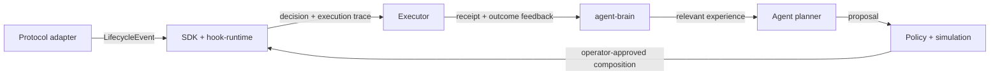

# Agent Hooks

Agent Hooks is an open source, continuous execution and experience framework for autonomous agents in Solana, crypto, and other digital worlds. Hooks are small, composable programs that respond to lifecycle events. Brains learn from the outcomes those hooks produce, so agents can use accumulated experience when planning future launches and actions.

The framework keeps execution, memory, and planning as separate interfaces. Protocol adapters normalize events; the SDK and Rust runtime compose, simulate, and evaluate hooks; the Anchor program provides the on-chain composition registry and executor; `agent-brain` stores event and outcome experience; and agent integrations create proposals through policy checks before an operator approves changes.

The feedback loop is:



`agent-brain` supplies a storage boundary and experience retrieval API. It does not claim to train a model itself: deployments choose their event store, retrieval strategy, and model provider. This lets the open source community connect different agent stacks and share reusable hook programs and learning systems.

## Workspace packages

| Package | Responsibility | Interfaces with |
| --- | --- | --- |
| `@agent-hooks/sdk` (`packages/sdk-ts`) | TypeScript composition builder, simulator, executor client, and hook helpers | Adapters, Anchor IDL, CLI, agent-brain |
| `hook-runtime` (`packages/hook-runtime`) | Rust lifecycle types, deterministic hook composition, execution traces, and backtesting | Hook library and on-chain integration |
| `anchor-program` (`packages/anchor-program`) | Anchor program for pool registration, composition storage, hook listings, and execution receipts | SDK executor client and protocol integrations |
| `@agent-hooks/agent-brain` (`packages/agent-brain`) | Append and query event/outcome experiences through a replaceable store interface | SDK `LifecycleEvent` types and agent planners |
| `@agent-hooks/agent-runtime` (`packages/agent-runtime`) | Versioned proposals and policy validation for agent plans | Brains, simulators, CLI, and operator approval flows |
| `@agent-hooks/marginfi-adapter` | Marginfi event and market normalization | SDK and hook-runtime |
| `@agent-hooks/kamino-adapter` | Kamino Lend event and market normalization | SDK and hook-runtime |
| `@agent-hooks/solend-adapter` | Solend event and market normalization | SDK and hook-runtime |
| `@agent-hooks/cli` | Create, inspect, simulate, and print deployment plans | SDK and agent-runtime |
| `agent-hooks-vscode` (`packages/vscode-extension`) | Composition visualization, simulation, and deployment-plan tooling | SDK |

### Execution and learning boundaries

1. An adapter emits a normalized `LifecycleEvent` for a protocol action.
2. The SDK or Rust runtime matches hooks to that event, evaluates them in configured priority order, and records the decisions and side effects.
3. The Anchor executor stores and runs approved on-chain compositions; receipts and downstream outcome signals can be associated with the original event.
4. An integration writes the event, composition identity, hook outcomes, reward/feedback, and optional tags to `AgentBrain.observe()`.
5. Before planning the next launch, an agent calls `AgentBrain.recall()` for relevant prior outcomes, then simulates and validates its proposal.
6. An authorized operator approves composition mutations and deployments.

Experience records are append-only observations. They make results reproducible and available to future agents; they do not by themselves guarantee profitable behavior, prove causation, or update a model's weights.

## Quick start

Requirements: Node.js 22 or newer, pnpm 9, Rust stable, and Anchor 0.31 for the on-chain program.

```bash
pnpm install
pnpm build
cargo build
```

The CLI supports deterministic simulation and non-signing proposal creation:

```bash
pnpm --filter @agent-hooks/cli start -- simulate --pool SOL-USDC --steps 240
pnpm --filter @agent-hooks/cli start -- agent plan --objective "Review SOL-USDC liquidation hooks" --json
```

To wire experience storage, implement the `ExperienceStore` interface and pass it to `AgentBrain`:

```ts
import { AgentBrain, type ExperienceStore } from "@agent-hooks/agent-brain";

declare const store: ExperienceStore; // application-owned durable store
const brain = new AgentBrain(store);
await brain.observe({
  event,
  feedback: {
    compositionId: "sol-usdc-v1",
    hookProgramIds: ["<hook-program-id>"],
    accepted: true,
    outcome: "executed",
    reward: 0.7,
  },
  tags: ["solana", "liquidation-policy"],
});
const priorOutcomes = await brain.recall({ adapter: event.adapter, kind: event.kind });
```

## Development status

The project is a development codebase. The production domain is intended to be `agenthooks.io`; it is a placeholder until a site is deployed. The Anchor program ID in this repository is a placeholder and is not a deployed Agent Hooks address. Configure a generated program ID before building or deploying on-chain artifacts. See [deployment notes](docs/deployment.md) and [security assumptions](docs/security.md).

## Project layout

```text
packages/
  agent-brain/       experience memory and retrieval boundary
  agent-runtime/     agent proposals and policy validation
  hook-runtime/      Rust event model and composition engine
  hook-library/      standard lending hooks
  anchor-program/    on-chain executor and registry
  sdk-ts/            TypeScript SDK and simulator
  *-adapter/         protocol-specific event normalization
  cli/               command-line tooling
  vscode-extension/  editor designer and simulator
docs/                architecture, deployment, hooks, and security
examples/            example lending-pool compositions
assets/              architecture, lifecycle, and hook diagrams
```

## License

Apache-2.0.
