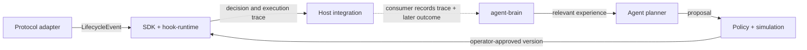

# Agent Hooks


[](https://agenthooks.io)


Agent Hooks is an open-source, real-time execution and experience framework for agents on Solana, crypto protocols, and other digital worlds. It separates **The Mind**—planning and learning from verified outcomes—from **The Hook**—bounded, deterministic conditions at an execution boundary.

```text
                THE MIND (off-chain)
 verified outcomes ──> agent-brain ──> planner ──> simulate + policy
       ▲                                              │
       │ later feedback                    reviewed proposal
       │                                              ▼
       └──── host integration <── THE HOOK (deterministic runtime)
                                       │
                                       └── propose allow / reject / bounded effects

 Today: Anchor registry records eligibility receipts; protocol hook CPI is not wired.
```

The loop is continuous: observe an event, evaluate deterministic guards, record the later outcome, retrieve relevant experience, and propose the next version. Model output is never itself an execution guardrail.

The framework keeps execution, memory, and planning as separate interfaces. Protocol adapters normalize events; the SDK and Rust runtime compose, simulate, and evaluate hooks; the Anchor program provides an on-chain composition registry and an early eligibility executor; `agent-brain` stores event and outcome experience; and agent integrations create proposals through policy checks before an operator approves changes.

The feedback loop is:



`agent-brain` supplies a storage boundary, provenance labels, per-hook trace memory, retrieval API, and low-latency in-process subscriptions for newly persisted outcomes. It does not train a model or verify RPC data by itself: deployments choose their event store, trusted chain observer, reward definition, retrieval strategy, and model provider. This lets the open source community connect different agent stacks and share reusable hook programs and learning systems. Keep model inference and memory retrieval off the transaction-critical path; hooks that directly gate an action should be deterministic, bounded, and testable.

## How hooks work

1. An adapter or replay source normalizes an observation of a deposit, borrow, repay, or liquidation into a `LifecycleEvent` with protocol, position, market/oracle snapshot, and action payload. The current adapters are read-oriented; they do not intercept every live protocol action.
2. Each hook declares the lifecycle flags it supports. The runtime sorts hooks by priority and skips hooks that did not declare the event.
3. Eligible hooks inspect the event and return `Accept`, `AcceptWith(side effect)`, or `Reject(reason)`. Rejection stops the composition; accepted side effects are collected for the host to apply.
4. The host records the decision trace and later joins it with the real outcome, such as whether a position stayed healthy or a liquidation completed.
5. `agent-brain` stores the event, composition and hook identities, feedback, and tags. An agent can retrieve similar outcomes before proposing a revised composition.

This is crucial for agents because it separates *what the agent proposes* from *what the runtime permits*. Agents can adapt their plans from prior outcomes, while a narrow deterministic hook checks the next action. A model response is not itself an execution guardrail. Keep model inference and memory retrieval outside the transaction-critical path.

### What is implemented today

The Rust runtime and TypeScript simulator evaluate hooks locally. `agent-hooks-policy` is a functional Anchor 0.31 CPI gate example that checks quoted-output slippage and slot cooldown, with a pause switch and an executor-PDA authority check. The configured downstream executor must call it immediately before its own state-mutating CPI and propagate rejection. It cannot constrain a protocol that does not integrate the gate.

The separate `agent-hooks-executor` composition registry remains an early prototype: `run_composition` checks event/adapter eligibility and emits receipts, but it does not yet CPI into its registered hook programs. Its `HookRan` decision field remains a placeholder and must not be treated as an evaluated decision.

## Workspace packages

| Package | Responsibility | Interfaces with |
| --- | --- | --- |
| `@agent-hooks/sdk` (`packages/sdk-ts`) | TypeScript orchestration: compose hooks, simulate, and build executor instructions | Adapters, Anchor IDL, CLI, agent-brain |
| `@agent-hooks/adapter-core` | Shared normalized lifecycle and pool snapshot contracts for protocol adapters | Marginfi, Kamino, Solend, SDK |
| `hook-runtime` (`packages/hook-runtime`) | Rust lifecycle event model, deterministic hook composition, traces, and simulation | Hook library and on-chain integrations |
| `agent-brain` (`packages/agent-brain`) | Experience memory interface with bounded local and PostgreSQL stores, provenance labels, traces, and subscriptions; no model training included | SDK events and agent planners |
| `anchor-program` (`packages/anchor-program`) | Anchor 0.31 registry prototype plus `agent-hooks-policy` slippage/cooldown CPI gate example | Solana programs and SDK clients |
| `@agent-hooks/agent-runtime` (`packages/agent-runtime`) | Versioned proposals, policy validation, and content-bound operator approvals | Brains, simulators, CLI, and operator approval flows |
| `@agent-hooks/toolkit` (`packages/toolkit`) | Standalone TypeScript hooks, experience memory, X workflow, and treasury review primitives | Independent agent applications; no required runtime dependencies |
| `@agent-hooks/marginfi-adapter` | Marginfi event and market normalization | SDK and hook-runtime |
| `@agent-hooks/kamino-adapter` | Kamino Lend event and market normalization | SDK and hook-runtime |
| `@agent-hooks/solend-adapter` | Solend event and market normalization | SDK and hook-runtime |
| `@agent-hooks/cli` | Create, inspect, simulate, and print deployment plans | SDK and agent-runtime |
| `agent-hooks-vscode` (`packages/vscode-extension`) | Composition visualization, simulation, and deployment-plan tooling | SDK |

### Execution and learning boundaries

1. An adapter emits a normalized `LifecycleEvent` for a protocol action.
2. The SDK or Rust runtime matches hooks to that event, evaluates them in configured priority order, and records the decisions and side effects.
3. The registry prototype stores compositions and emits eligibility receipts; it does not invoke those listed hooks. The separate policy-gate example can enforce slippage/cooldown when an allowlisted executor actually calls it by CPI.
4. An integration writes the event, composition identity, hook outcomes, reward/feedback, and optional tags to `AgentBrain.observe()`.
5. Before planning the next launch, an agent calls `AgentBrain.recall()` for relevant prior outcomes, then simulates and validates its proposal.
6. An authorized operator records an approval bound to the proposal's SHA-256 fingerprint. Any change to its objective, evidence, actions, risks, or simulation requirement invalidates that approval before it can reach an application-owned execution layer.

Experience records are append-only observations. They make results reproducible and available to future agents; they do not by themselves guarantee profitable behavior, prove causation, or update a model's weights.

## Quick start

Requirements: Node.js 22 or newer, pnpm 9, Rust stable, and Anchor 0.31 for the on-chain program.

```bash
pnpm install
pnpm build
cargo build
```

The CLI supports deterministic simulation and non-signing proposal creation:

```bash
pnpm --filter @agent-hooks/cli start -- simulate --pool SOL-USDC --steps 240
pnpm --filter @agent-hooks/cli start -- agent plan --objective "Review SOL-USDC liquidation hooks" --json
```

## Standalone TypeScript toolkit

Install the independently packable TypeScript toolkit with `npm install @agent-hooks/toolkit`. It separates Solana hook evaluation, agent learning, daily X drafting, and chain-qualified treasury proposal review into import paths documented in [`packages/toolkit/README.md`](packages/toolkit/README.md). The toolkit workflow requires a human approval step; treasury proposals can describe Solana, Bitcoin, or Ethereum transfers but do not hold keys or sign/broadcast transactions. The local Python X publisher supports either OAuth 1.0a or OAuth 2.0 user authorization and keeps unattended publishing behind an explicit per-profile opt-in. The package is configured for public npm distribution, but has not yet been published.

To wire experience storage, implement the `ExperienceStore` interface and pass it to `AgentBrain`:

```ts
import { AgentBrain, type ExperienceStore } from "@agent-hooks/agent-brain";

declare const store: ExperienceStore; // application-owned durable store
const brain = new AgentBrain(store);
await brain.observe({
  event,
  feedback: {
    compositionId: "sol-usdc-v1",
    hookProgramIds: ["<hook-program-id>"],
    accepted: true,
    outcome: "executed",
    reward: 0.7,
    rewardUnit: "normalized_0_1",
  },
  evidence: { channel: "simulation", status: "observed" },
  trace: [{ hookId: "<hook-program-id>", decision: "accepted" }],
  tags: ["solana", "liquidation-policy"],
});
const priorOutcomes = await brain.recall({ adapter: event.adapter, kind: event.kind });
```

Feedback is not automatically verified: missing provenance is stored as `unknown/unverified`. Use `recall({ verifiedOnly: true })` to request records labeled confirmed/finalized by a trusted chain observer; the brain validates required identifiers but does not verify RPC data or signatures itself.

Before an application routes a mutation to its transaction service, bind the human review to the exact proposal body:

```ts
import { createProposalApproval, validateExecutionReadiness } from "@agent-hooks/agent-runtime";

const approval = createProposalApproval(proposal, {
  decision: "approved",
  approver: authenticatedOperator.id,
});
const readiness = validateExecutionReadiness(proposal, approval);
if (!readiness.valid) throw new Error(readiness.violations.join("; "));
```

This is an application audit primitive, not a wallet signature. The separately authorized transaction service must still authenticate its caller, re-check its limits, and use its own restricted signing authority.

## First agent: Harbor, paired with X

Start Harbor as an off-chain research and reporting assistant paired with the project's X account. It watches configured public X sources for hook and launch reports, stores source IDs and links as evidence, joins those reports with verified on-chain events, recalls similar outcomes from `agent-brain`, and drafts policy changes through `agent-runtime`. It simulates each proposal, then queues it for an operator. After a run is reviewed, Harbor can publish the result and evidence links on X.

Treat X content as attributed context rather than protocol state. An X post must never directly change a live composition, and the X-facing worker should not have a Solana signing key. The X API credentials and posting identity must be supplied by the project owner when the integration is built. See [the Harbor architecture and rollout](docs/first-agent.md).

The initial local X workflow is in [`apps/x-agent-bot/agent_x.py`](apps/x-agent-bot/agent_x.py): it uses Qwen 2.5 0.5B via Transformers for local drafts and Tweepy for optional X API publishing. It is dry-run by default, accepts only supplied context, offers interactive confirmation by default, and permits unattended daily posting only when both `--auto-post` and `X_AGENT_AUTOPUBLISH=true` are configured for that user's profile. OAuth 1.0a and OAuth 2.0 user authorization are supported; app-only X tokens are not suitable for posting. It has no wallet or treasury key access. See the [local X agent tutorial](internal-digest/x_agent_tutorial.md). The React [XAgentChatbox preview](apps/web/components/XAgentChatbox.tsx) simulates local prompts; it does not connect to X or a wallet. This is a component-only workspace package, not a reconstructed site or router.

## Development status

The project is a development codebase. The production domain is intended to be `agenthooks.io`; it is a placeholder until a site is deployed. The Anchor program ID in this repository is a placeholder and is not a deployed Agent Hooks address. Configure a generated program ID before building or deploying on-chain artifacts. See [deployment notes](docs/deployment.md) and [security assumptions](docs/security.md).

## Project layout

```text
packages/
  agent-brain/       experience memory and retrieval boundary
  agent-runtime/     agent proposals and policy validation
  hook-runtime/      Rust event model and composition engine
  hook-library/      standard lending hooks
  anchor-program/    on-chain executor and registry
  sdk-ts/            TypeScript SDK and simulator
  toolkit/           standalone, packable TypeScript hooks + agent toolkit
  anchor-program/
    programs/agent-hooks-policy/ slippage/cooldown CPI gate example
  *-adapter/         protocol-specific event normalization
  cli/               command-line tooling
  vscode-extension/  editor designer and simulator
docs/                architecture, deployment, hooks, and security
apps/                local X bot and React prompt preview
internal-digest/     tutorial; private run data is git-ignored
examples/            example lending-pool compositions
assets/              architecture, lifecycle, and hook diagrams
```

## License

MIT. See [LICENSE](LICENSE). The standalone toolkit is also MIT licensed.
