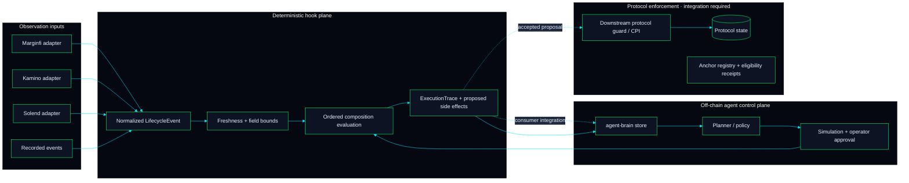

# Architecture

Agent Hooks is split into a deterministic hook plane and an off-chain agent control plane. Adapters normalize observations; the runtime validates, evaluates, and traces hooks; a protocol integration must enforce accepted decisions before mutating protocol state. Brains can retain those traces alongside later outcomes so planners can use operational history without becoming transaction authorities.



## Workspace layers

| Layer | Current responsibility | Boundary |
|---|---|---|
| Protocol adapters | Read pool/account snapshots and normalize data to the shared `LifecycleEvent` shape. | Current adapters are read-oriented; they do not subscribe to and intercept every protocol lifecycle transaction. |
| `@agent-hooks/sdk` | TypeScript event, composition, and simulator interfaces. | Its local simulator is not a protocol enforcement point. |
| `hook-runtime` | Rust event validation, ordered hook evaluation, bounded side-effect proposals, audit traces, and historical simulation. | It evaluates local Rust `Hook` implementations; side effects are proposals until a host applies them. |
| `agent-brain` | Storage interface with bounded in-memory and PostgreSQL implementations for events and hook feedback; query or stream prior experience to a planner. | PostgreSQL uses an injected host database client; provenance labels remain caller-reported and are not cryptographically verified. No automatic reward attribution, causal model, or model training. |
| `agent-runtime` | Agent proposal, simulation, and approval boundaries. | Model outputs remain untrusted proposals and cannot sign or submit transactions. |
| `@agent-hooks/toolkit` | Standalone TypeScript hook engine, bounded memory, daily X workflow, and treasury review queue. | Local workflow primitives only; production hosts provide durable stores, identity authentication, chain adapters, and execution services. |
| Anchor executor | Pool/composition registration, eligibility receipts, and hook listing metadata. | `run_composition` does not CPI into registered hook programs, enforce their decisions, or mutate downstream protocol state. |
| Anchor policy example | A standalone policy instruction with bounded inputs and executor-PDA authorization. | A downstream protocol must call it before its own mutation and bind the checked values to that exact action; this sample is not itself a swap executor. |

## Deterministic evaluation path

An adapter or replay source produces a `LifecycleEvent`. A caller supplies a trusted `ExecutionContext.current_slot`; the runtime does not treat the event's own slot as the live clock. `EventValidationPolicy` bounds staleness, payload size, oracle observations, confidence, LTV, and basis-point fields. The host must authenticate source programs and oracle account ownership before constructing the normalized event: shape and range validation cannot prove provenance.

`Composition` orders up to eight local hooks by priority. Lifecycle flags decide whether a hook is called. The runtime enforces capability flags for rejection and side effects, checks LTV/rate/delay bounds, bounds instruction payloads, and fails closed when an oracle-dependent hook has no observations. An `ExecutionTrace` retains each hook result. If any hook rejects or returns an unauthorized/out-of-policy decision, the composition is rejected and executable side effects are cleared.

The returned trace is evidence of local evaluation, not evidence that a chain transaction executed. A production protocol integration still needs an explicit trust path: validate the caller and accounts, invoke approved hook programs through bounded CPI interfaces, stop on rejection, and only then mutate protocol state. The current Anchor executor does not implement that path.

## Experience feedback loop

`agent-brain` accepts a normalized event and caller-supplied hook feedback. A consumer should keep simulation, operator judgment, submitted transactions, and confirmed/finalized outcomes distinguishable; only appropriately verified outcomes should inform a policy presented as on-chain performance. `AgentBrain.recall()` retrieves past records by protocol event, composition, outcome, hook, tag, time window, or caller-labeled chain evidence for an off-chain planner. It does not train a model, establish causality, or prove that a prior decision caused an outcome.

```text
observe → validate → evaluate hooks → preserve trace → protocol integration executes
                                                     ↓
                  later verified outcome → experience store → planner proposal
                                                               ↓
                                                 simulation + policy + approval
```

## Solana-specific design

On EVM, Uniswap v4 can encode hook capabilities in contract-address bits. Solana addresses are derived from keys, so Agent Hooks stores declared flag bits in composition metadata rather than requiring hook authors to grind keypairs. Those bits are declarations, not a security boundary by themselves: the caller and executor must verify the registered program, account relationships, capabilities, and CPI result at the point of enforcement.

The current Anchor executor is a registry/receipt prototype. Its events are useful for indexing eligibility but must not be interpreted as hook execution receipts. See [the hook specification](hooks-spec.md), [security notes](security.md), and [deployment status](deployment.md) before treating an example as production enforcement.
