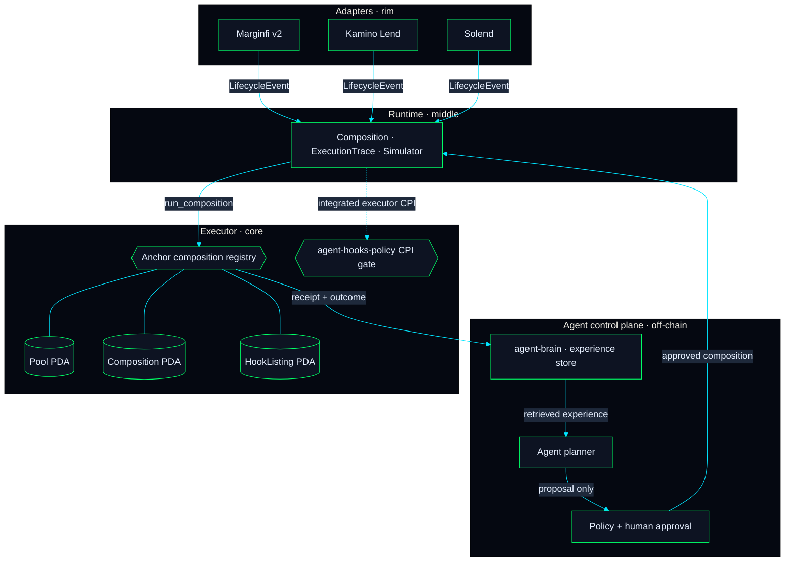

# Architecture

Agent Hooks separates protocol adaptation, deterministic execution, experience memory, and agent planning. This lets agents learn from live feedback without coupling hook evaluation to a model provider.

## Adapters at the rim

Each adapter is a small TypeScript package that wraps the protocol's existing SDK and emits a normalised `LifecycleEvent`. The shape is identical across adapters so a Composition built against Marginfi can be replayed against Kamino without code changes (only configuration changes).

## Runtime in the middle

`packages/hook-runtime` (Rust) and `packages/sdk-ts/simulator.ts` (TypeScript) implement the same decision tree. The Composition is an ordered list of hook entries plus their priority and flags bitmap. The runtime checks each hook's flags against the event kind, runs the eligible ones in priority order, and either accumulates side effects or short-circuits on the first reject.

## Executor at the core

`packages/anchor-program/programs/agent-hooks-executor` is the Anchor 0.31 composition registry. Compositions live in PDAs keyed by `(pool, slot_index)`; a pool can have up to eight slots, with up to eight hooks in each slot. The pool authority installs and updates compositions.

At present, `run_composition` validates the event kind, pool binding, adapter, and payload size. It counts entries whose declared flags match the event, then emits `HookRan` and `CompositionExecuted` receipts. The per-hook decision in `HookRan` is currently a placeholder. This instruction does not invoke registered hook programs or apply side effects.

`packages/anchor-program/programs/agent-hooks-policy` is a separately deployable Anchor 0.31 policy hook. It checks a quote/minimum-output slippage bound and slot cooldown, and it requires the configured executor program's signer PDA. A downstream execution program must CPI into the policy hook before its mutation, bind the checked values to the exact swap/action, and propagate errors. The sample program does not swap assets itself and cannot constrain programs that choose not to call it.

## Why hook flags live in PDAs, not in the program address

Uniswap v4 encodes hook flags in the contract address. That works on EVM because addresses are arbitrary. On Solana, addresses are ed25519-derived — forcing brute-force keypair search to embed bits would be hostile to hook authors. AGENT HOOKS stores the flag bitmap in a PDA the executor reads at install time, achieving the same guarantee without keypair gymnastics.

## Agent control plane

`packages/agent-runtime` gives AI agents a deliberately narrow integration surface: they can generate versioned proposals, attach assumptions and evidence, and request deterministic simulations. Policies reject unapproved or unsimulated mutations. The local `apps/x-agent-bot/agent_x.py` uses Qwen 2.5 0.5B for an X draft; publishing is explicit and interactively confirmed. The bot has no Solana signer, private-key, transaction-submission, or deployment capability.

## Continuous experience loop

`LifecycleEvent` is the shared boundary between adapters, simulations, and the brain. An execution receipt and any later outcome feedback are stored with the event, hook IDs, and composition ID using `AgentBrain.observe()`. Later, `AgentBrain.recall()` returns prior experiences by adapter, event kind, or composition so a planner can form its next proposal. A store implementation may use an append-only database and optional similarity search; the package itself does not train a model or infer causality from correlation.
