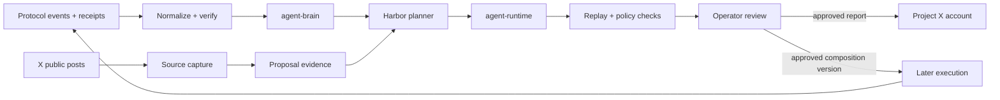

# First agent: Harbor

Harbor is a proposed first Agent Hooks agent: an off-chain research and reporting assistant paired with the project's X account. It observes hook executions and public launch discussions, uses prior outcomes as context, and drafts the next experiment. It does not act as an autonomous trader.

## Data flow

## One learning cycle

1. Collect protocol lifecycle events and executor receipts through a protocol adapter and an indexer/RPC source. Verify the program, pool, slot, and composition before treating a receipt as authoritative.
2. Store lifecycle events with hook decisions and later outcomes through `AgentBrain.observe()`. The current Anchor prototype emits eligibility receipts only, so its receipt decision field must not be treated as a real hook decision yet.
3. Capture public X posts with their post ID, author, timestamp, and canonical link. Treat these as attributed reports and claims, not as protocol state; keep them as proposal evidence until a social-observation store is added.
4. Harbor recalls similar lifecycle experiences, summarizes evidence and uncertainty, and drafts a versioned proposal with `agent-runtime`.
5. Replay the candidate against historical events. Reject proposals that violate policy, omit required evidence, or fail configured risk limits.
6. An operator reviews the trace and approves or rejects the proposal. Only a separately authorized operator can install a composition.
7. Harbor can publish the reviewed result on X with links to the source data and limitations. X posting permission and a signing permission for program transactions belong in separate services and secret scopes.

## Build sequence

1. Define the agent identity, success metrics, allowed protocols, and policy boundaries.
2. Implement read-only collectors for lifecycle events, receipts, and X reports. Keep original source IDs and timestamps for audit and deduplication.
3. Provide a durable `ExperienceStore` implementation for `@agent-hooks/agent-brain`; start with exact filtering by adapter, event kind, and composition before adding vector search.
4. Add a model provider behind an agent-owned planner interface. Give the planner retrieved records and evidence references, then require structured proposal output.
5. Run simulations and policy validation in CI. Publish proposals to an operator queue before enabling any X posting.
6. Add X publishing after review works reliably. Store API credentials in the deployment secret manager; never check credentials into this repository or provide them to the on-chain executor.

## Initial permissions

Harbor can read configured public X sources, read indexed protocol data, append experience records, simulate compositions, and draft proposals. At first, it should not write to X, sign Solana transactions, or install compositions. X posting can be enabled as a separate reviewed permission after the reporting pipeline has an audit trail.

This package set currently provides the hook runtime, simulators, `agent-brain` interface, proposal schema, and policy checks. It does not yet include an X client, an agent model, a durable store, a proposal review UI, or on-chain CPI into hooks. Those are the first implementation tasks for turning Harbor from an architecture into a running agent.
